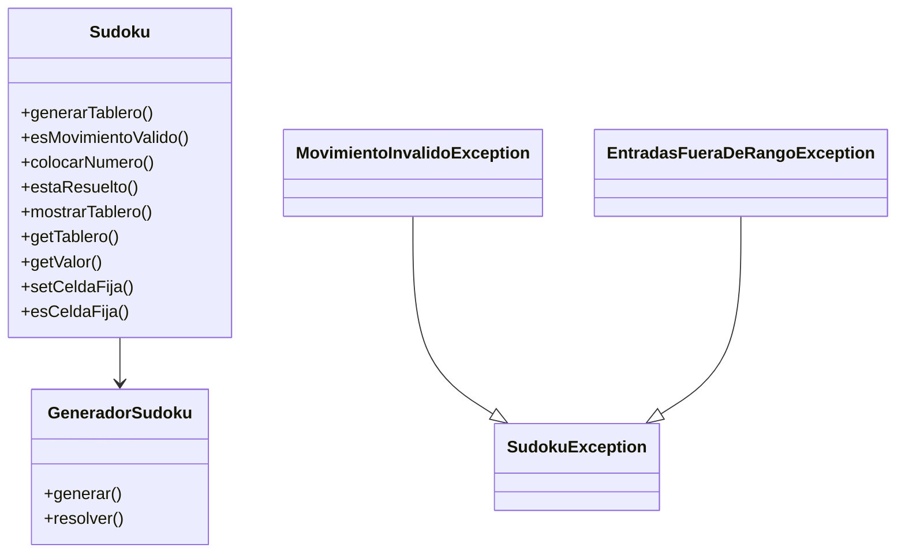

# Proyecto Sudoku - Documentación Técnica

Este proyecto implementa un juego de Sudoku en Java que permite:
- Generar tableros válidos de Sudoku según dificultad (fácil, medio, difícil)
- Validar movimientos según las reglas del juego
- Resolver el tablero usando el algoritmo de backtracking
- Manejar excepciones personalizadas para una experiencia robusta
- Ejecutar pruebas unitarias con JUnit
- Interactuar desde la consola con una interfaz clara

---

---

## 📋 Rúbrica de Evaluación

| **Aspecto a Evaluar**                 | **Descripción**                                                                                 | **Peso (sobre 10)** |
|--------------------------------------|-------------------------------------------------------------------------------------------------|---------------------|
| **1. Generación del Tablero**        | Creación correcta de tableros para niveles fácil, medio y difícil, respetando las reglas.       | 1.0                 |
| **2. Validación de Movimientos**     | Validación en tiempo real de las jugadas con feedback claro al usuario.                         | 1.0                 |
| **3. Implementación del Backtracking**| Uso eficiente del algoritmo de backtracking para generar y resolver tableros.                   | 1.5                 |
| **4. Diseño y Arquitectura**         | Estructura modular, separación de responsabilidades y uso adecuado de POO.                      | 1.0                 |
| **5. Manejo de Excepciones**         | Uso de excepciones específicas con mensajes claros (SudokuException, etc.).                     | 1.0                 |
| **6. Calidad del Código y Comentarios** | Código legible, bien nombrado y comentado.                                                    | 0.5                 |
| **7. Pruebas Unitarias**             | Pruebas JUnit completas, cubriendo casos positivos, negativos y bordes.                         | 1.5                 |
| **8. Interfaz de Usuario**           | Interfaz funcional (consola o gráfica), clara y fácil de usar.                                  | 1.0                 |
| **9. Documentación y Entrega**       | Análisis técnico, diagramas UML, matriz de trazabilidad y organización del proyecto.            | 1.5                 |

---

## 📚 Contenido del Proyecto

- **Lenguaje:** Java
- **Herramientas:** JDK 17+, JUnit 5, IntelliJ IDEA / Eclipse
- **Paquetes principales:**
  - `org.example`: Clases principales (`Sudoku`, `GeneradorSudoku`, etc.)
  - `org.example.exceptions`: Excepciones personalizadas
  - `test`: Pruebas unitarias

---

## 🧠 Lógica del Juego

- El tablero es una matriz 9x9.
- La clase `GeneradorSudoku` genera tableros aleatorios y resuelve con backtracking.
- Se pueden fijar celdas para representar el tablero inicial.
- Se validan los movimientos conforme a las reglas del Sudoku.
- Se verifica si el tablero está resuelto al completar.

---

## 🛠️ Arquitectura

- **Sudoku:** Lógica del tablero y operaciones.
- **GeneradorSudoku:** Generación y resolución de tableros.
- **Excepciones personalizadas:** Para errores específicos.
- **SudokuTest:** Verificación con JUnit.

---

## 🧪 Pruebas Unitarias

- **JUnit 5**
- Se incluyen tests para:
  - Generación del tablero
  - Validación de movimientos
  - Colocación de números
  - Verificación de tablero resuelto
  - Manejo de excepciones
  - Métodos auxiliares (`getValor`, `mostrarTablero`, etc.)

---

## 📐 UML (Diagrama de Clases)

