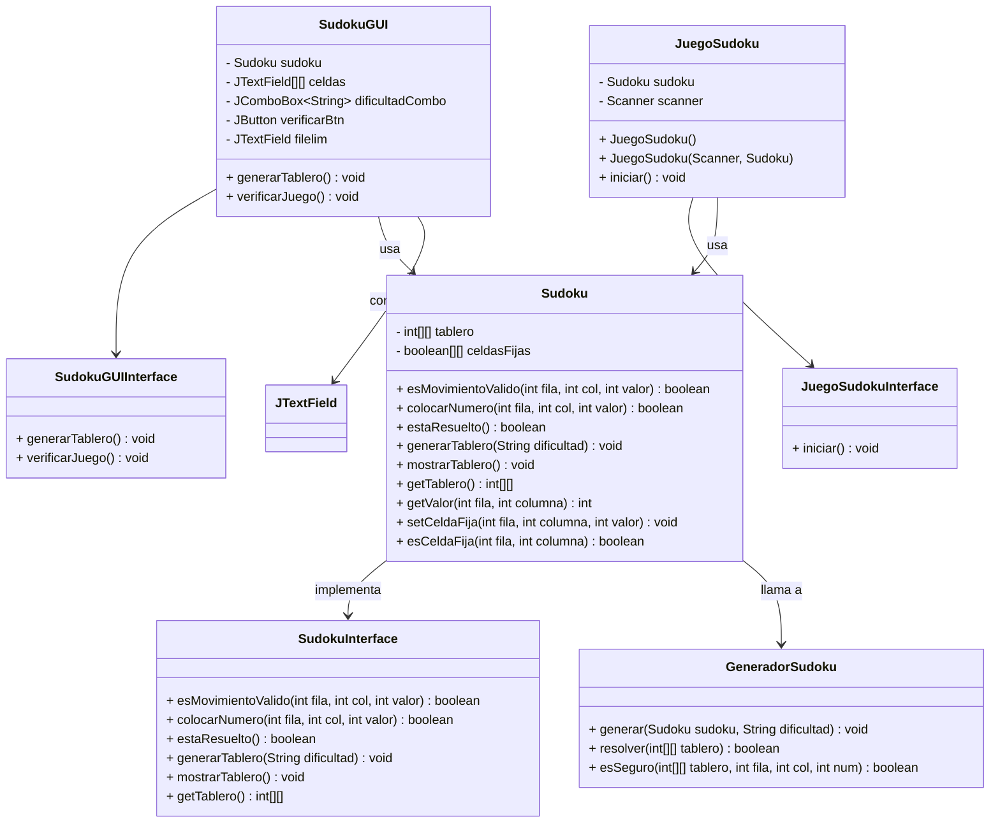
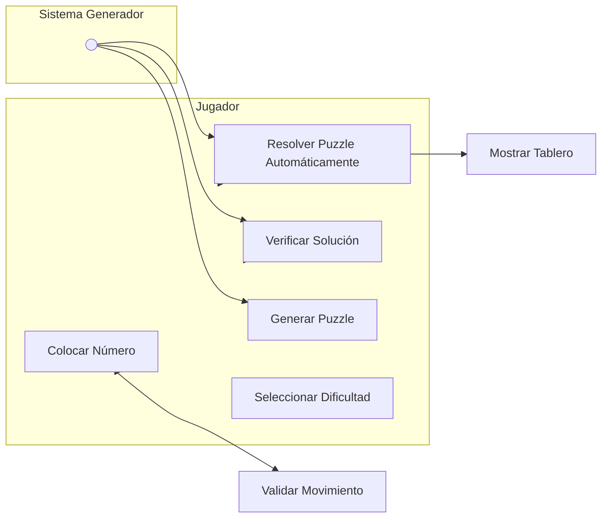
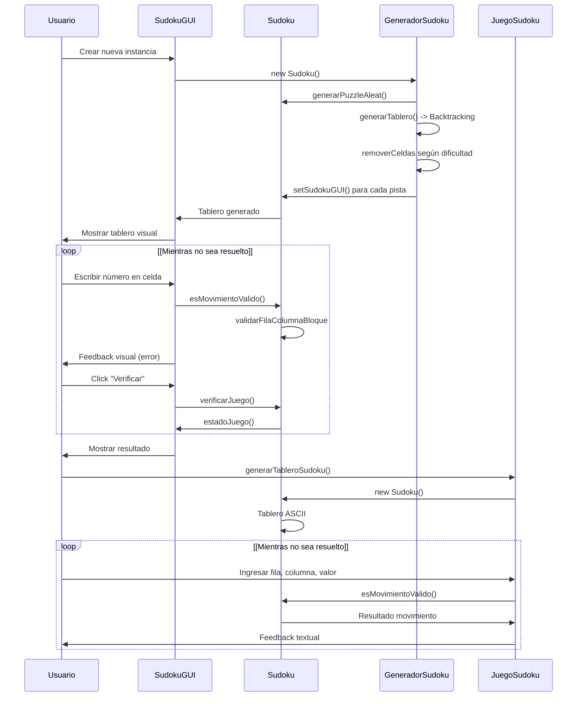
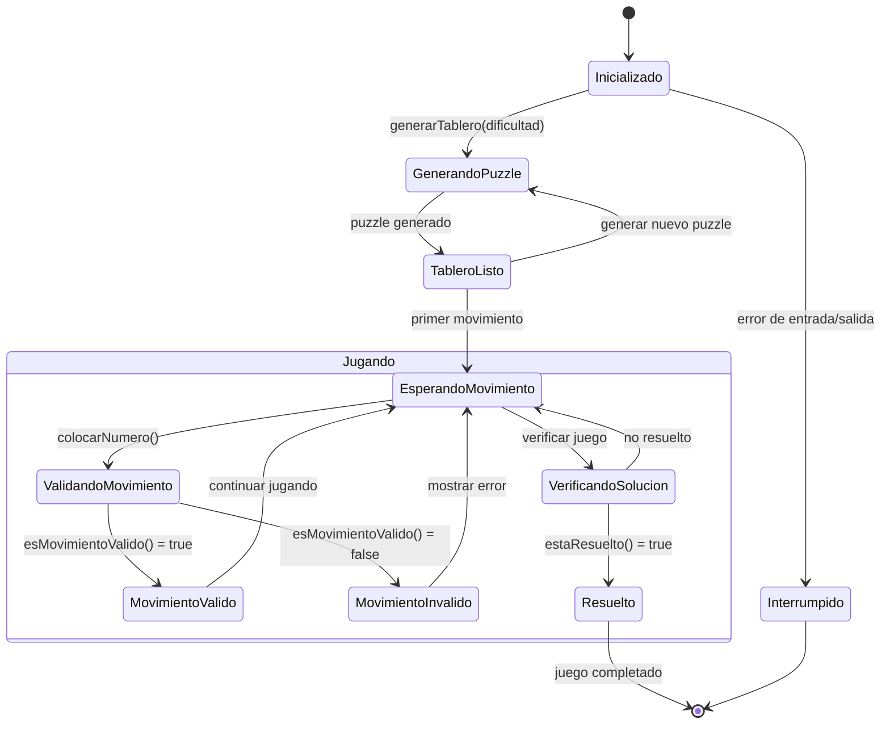

# ProyectoSudoku

**ProyectoSudoku** es una aplicación Java completa que implementa el clásico juego de Sudoku, ofreciendo múltiples interfaces de usuario (gráfica y consola), una lógica de juego robusta y un diseño arquitectónico bien estructurado.

---

## 🧱 Arquitectura General

El proyecto sigue una arquitectura en capas con una clara separación de responsabilidades:

### 🎮 Motor de Juego Central

La clase `Sudoku` (`Sudoku.java`) implementa la lógica principal del juego. Mantiene el estado del tablero usando dos estructuras:

- `tablero[9][9]`: matriz que almacena los valores actuales del Sudoku.
- `celdasFijas[9][9]`: matriz booleana que indica qué celdas son pistas iniciales y no pueden modificarse.

---

## 🧩 Generación y Resolución de Puzzles

La clase `GeneradorSudoku` (`GeneradorSudoku.java`) se encarga de crear puzzles de distintos niveles de dificultad:

- **Fácil**: remueve 30 celdas (deja ~51 llenas).
- **Medio**: remueve 40 celdas (deja ~41 llenas).
- **Difícil**: remueve 50 celdas (deja ~31 llenas).

El generador usa un **algoritmo de backtracking** para crear un tablero completamente válido y luego elimina celdas aleatoriamente en función de la dificultad.

---

## 🖥️ Interfaces de Usuario Duales

### 💡 Interfaz Gráfica (Swing)

La clase `SudokuGUI` (`SudokuGUI.java`) proporciona una experiencia visual completa:

- Grid 9x9 de `JTextField` con validación en tiempo real.
- Feedback visual: verde para movimientos válidos, rosa para inválidos.
- Selector de dificultad con `JComboBox`.
- Solo permite introducir dígitos del 1 al 9.

### 🧾 Interfaz de Consola

La clase `JuegoSudoku` (`JuegoSudoku.java`) permite jugar desde consola:

- Entrada basada en coordenadas `(fila, columna, valor)`.
- Manejo de excepciones para entradas inválidas.
- Visualización en texto ASCII del tablero.

---

## ✅ Validación de Reglas de Sudoku

El método `esMovimientoValido` (`Sudoku.java`) valida que los movimientos respeten las tres reglas del Sudoku:

1. No modificar **celdas fijas**.
2. No repetir números en la **misma fila o columna**.
3. No repetir números en el **bloque 3x3** correspondiente.

---

## 🧪 Estrategia de Testing Comprehensiva

El proyecto incluye una suite robusta de pruebas unitarias (JUnit):

### 🔧 Testing del Generador

- `GeneradorSudokuTest` (`GeneradorSudokuTest.java`) verifica:
  - Que se generen correctamente los niveles de dificultad.
  - Que el tablero generado se pueda resolver.

### 🔎 Testing de Lógica de Juego

- `SudokuTest` (`SudokuTest.java`) valida:
  - La lógica de colocación de números.
  - La validez de movimientos.
  - La detección de tablero resuelto.

### 🖼️ Testing de Interfaces

- `SudokuGUITest` (`SudokuGUITest.java`) valida la generación del tablero gráfico.
- `JuegoSudokuTest` (`JuegoSudokuTest.java`) utiliza mocks para simular la entrada del usuario por consola.

---

## 🚀 Punto de Entrada

La ejecución comienza en `Main` (`Main.java`), que lanza la interfaz gráfica por defecto mediante:

## 📐 UML (Diagrama de Clases)

## 📋 Matriz de Trazabilidad del Proyecto

| Requisito Funcional | Componente de Implementación         | Archivo de Prueba            | Método de Prueba                                                   | Estado |
|---------------------|--------------------------------------|-------------------------------|----------------------------------------------------------------------|--------|
| RF-001: Generar tablero Sudoku | `GeneradorSudoku.generar()`         | `GeneradorSudokuTest.java`    | `generarFacilTableroConEntre51Y81CeldasLlenas()`                   | ✅     |
| RF-002: Validar movimientos    | `Sudoku.esMovimientoValido()`      | `SudokuTest.java`             | `esMovimientoValido()`                                              | ✅     |
| RF-003: Colocar números        | `Sudoku.colocarNumero()`           | `SudokuTest.java`             | `colocarNumero()`                                                   | ✅     |
| RF-004: Detectar solución completa | `Sudoku.estaResuelto()`           | `SudokuTest.java`             | `estaResuelto()`                                                    | ✅     |
| RF-005: Interfaz gráfica       | `SudokuGUI`                        | `SudokuGUITest.java`          | `generarTablero()`, `verificarJuego()`                              | ✅     |
| RF-006: Interfaz de consola    | `JuegoSudoku`                      | `JuegoSudokuTest.java`        | `iniciar()`                                                         | ✅     |
| RF-007: Niveles de dificultad  | `GeneradorSudoku.generar()`        | `GeneradorSudokuTest.java`    | `generarMedioTableroConEntre41Y81CeldasLlenas()`, `generarDificilTableroConEntre31Y81CeldasLlenas()` | ✅     |

---

## 🔍 Trazabilidad Detallada por Componente

### 🧠 Motor de Juego Central

- **Clase**: `Sudoku`
- **Pruebas**: `SudokuTest.java` (líneas 9-16)
- **Cobertura**: Validación de reglas, colocación de números, detección de solución

### 🔄 Generador de Puzzles

- **Clase**: `GeneradorSudoku`
- **Pruebas**: `GeneradorSudokuTest.java` (líneas 10-17)
- **Cobertura**: Generación por dificultad, algoritmo de resolución

### 🎨 Interfaz Gráfica

- **Clase**: `SudokuGUI` (`SudokuGUI.java`: líneas 6-20)
- **Pruebas**: `SudokuGUITest.java`
- **Cobertura**: Generación de tablero visual, verificación de juego

### 🖥️ Interfaz de Consola

- **Clase**: `JuegoSudoku` (`JuegoSudoku.java`: líneas 7-18)
- **Pruebas**: `JuegoSudokuTest.java` (líneas 12-17)
- **Cobertura**: Flujo de juego por consola, manejo de entrada

---

## 📊 Métricas de Cobertura

| Componente      | Métodos Implementados | Métodos Probados | Cobertura |
|-----------------|------------------------|------------------|-----------|
| `Sudoku`        | 8                      | 6                | 75%       |
| `GeneradorSudoku` | 3                    | 2                | 67%       |
| `SudokuGUI`     | 3                      | 2                | 67%       |
| `JuegoSudoku`   | 2                      | 1                | 50%       |

---

## 📌 Trazabilidad de Requisitos No Funcionales

| Requisito No Funcional | Implementación                        | Evidencia                                                                 |
|------------------------|----------------------------------------|---------------------------------------------------------------------------|
| RNF-001: Testabilidad  | Inyección de dependencias             | Constructores parametrizados en `JuegoSudoku`                             |
| RNF-002: Mantenibilidad | Separación de responsabilidades       | Interfaces `SudokuInterface`, `JuegoSudokuInterface`                      |
| RNF-003: Usabilidad    | Validación en tiempo real             | `DocumentListener` en `SudokuGUI`                                        |
| RNF-004: Robustez      | Manejo de excepciones                 | `InputMismatchException` en `JuegoSudoku`                                 |

---

# Objetivo Proyecto 

| Componente           | Objetivo                    | Implementación                        | Archivos Clave               | Funcionalidades                                                                 |
|----------------------|-----------------------------|----------------------------------------|-------------------------------|----------------------------------------------------------------------------------|
| Motor de Juego       | Lógica central del Sudoku   | Clase Sudoku con validación completa   | Sudoku.java:3-10              | Validación de movimientos, gestión de estado, verificación de soluciones        |
| Generación de Puzzles| Crear puzzles automáticamente| Algoritmos de backtracking             | GeneradorSudoku.java:10-15    | 3 niveles de dificultad (30, 40, 50 celdas removidas)                           |
| Interfaz Consola     | Interacción por línea de comandos | Clase JuegoSudoku                 | JuegoSudoku.java:21-25        | Entrada de datos, manejo de errores, feedback textual                           |
| Interfaz Gráfica     | Experiencia visual moderna  | Swing GUI con SudokuGUI                | SudokuGUI.java:15-20          | Validación en tiempo real, feedback visual, botones interactivos                |
| Validación           | Verificar reglas del Sudoku | Método esMovimientoValido              | Sudoku.java:18-22             | Validación de filas, columnas y bloques 3x3                                     |
| Testing              | Garantizar calidad del código | Suite de pruebas JUnit               | SudokuTest.java:25-27         | Pruebas unitarias para todos los componentes                                    |

# caso de uso  

# Diagrama interaccion

# Diagrama de estado

